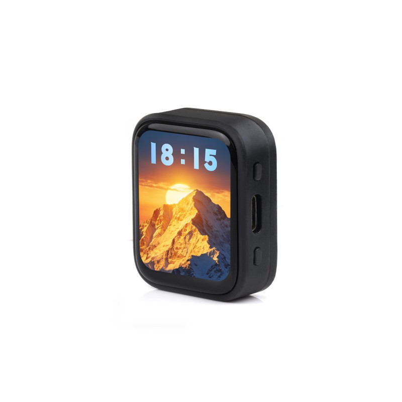

  <h1>ESP32-C6-Touch-AMOLED-1.8</h1>
  
<strong>ESP32-C6 1.8 英寸 368 x 448 QSPI AMOLED 触摸开发板</strong>

  

    
    
  

  

    <a href="README.md">English</a> ·
    <a href="https://www.waveshare.com/esp32-c6-touch-amoled-1.8.htm">商品页面</a> ·
    <a href="https://docs.waveshare.com/ESP32-C6-Touch-AMOLED-1.8">产品文档</a> ·
    <a href="https://github.com/waveshareteam/ESP32-C6-Touch-AMOLED-1.8/releases">GitHub Releases</a> ·
    <a href="https://github.com/waveshareteam/ESP32-C6-Touch-AMOLED-1.8/actions/workflows/examples.yml">CI 固件产物</a> ·
    <a href="examples/esp-idf/">ESP-IDF 示例</a> ·
    <a href="examples/arduino/">Arduino V1</a> ·
    <a href="examples/arduino-v2/">Arduino V2</a> ·
    <a href="docs/">仓库文档</a>
  

  

---

## 概述

本仓库提供适用于 Waveshare ESP32-C6-Touch-AMOLED-1.8 的第一方 ESP-IDF 工程、
独立的 Arduino V1/V2 示例集、基于源码构建的固件包、工厂恢复镜像和开发文档。

开发板集成 ESP32-C6、1.8 英寸 368 x 448 QSPI AMOLED 触摸屏、16 MB Flash、
电源管理、RTC、IMU、音频和 microSD，不带 PSRAM。

## 硬件版本

| 版本 | 显示控制器 | 触摸控制器 | Arduino 示例 |
| --- | --- | --- | --- |
| V1 | SH8601 | FT3168 / FT6146 | [examples/arduino](examples/arduino/) |
| V2 | CO5300 | CST820 | [examples/arduino-v2](examples/arduino-v2/) |

V1 与 V2 共用板级引脚。Arduino 示例会直接创建显示和触摸驱动，因此按版本保留
两个独立目录。ESP-IDF 示例统一使用 waveshare/esp32_c6_touch_amoled_1_8 BSP；
BSP 会探测触摸地址并自动选择对应的显示和触摸驱动，不需要修改示例源码。

> [!IMPORTANT]
> V2 开发板的实体触摸控制器是 CST820。软件中的
> <code>Arduino_CST816x</code> 和 <code>esp_lcd_touch_cst816s</code>
> 是兼容 CST820 的驱动名称，不代表板载芯片型号。

## 硬件概览

| 功能 | 器件 / 接口 |
| --- | --- |
| MCU | ESP32-C6，单核 32 位 RISC-V，最高 160 MHz（目标 esp32c6） |
| 无线连接 | 2.4 GHz Wi-Fi 6、Bluetooth 5 LE、IEEE 802.15.4（Zigbee 3.0 / Thread） |
| 存储 | 16 MB Flash，无 PSRAM |
| 显示 | 1.8 英寸 368 x 448 QSPI AMOLED |
| V1 显示 / 触摸 | SH8601 + FT3168 / FT6146 |
| V2 显示 / 触摸 | CO5300 + CST820 |
| 电源管理 | AXP2101 |
| 实时时钟 | PCF85063A |
| 运动传感器 | QMI8658 六轴 IMU |
| 音频 | ES8311 编解码器、麦克风输入和扬声器输出 |
| 扩展存储 | SPI microSD |
| 原理图 | [Schematic](Schematic/) |

## 快速开始

1. 先按上方表格确认开发板版本；版本不确定时，可运行
   [00_board_check](examples/esp-idf/00_board_check/) 由 BSP 输出检测结果。
2. ESP-IDF 建议从
   [00_bsp_quickstart](examples/esp-idf/00_bsp_quickstart/) 开始；同一套
   BSP 工程同时支持 V1 和 V2。
3. Arduino V1 使用 [examples/arduino](examples/arduino/)，V2 使用
   [examples/arduino-v2](examples/arduino-v2/)。
4. 无需本地构建时，可从成功的
   [Build Examples 运行](https://github.com/waveshareteam/ESP32-C6-Touch-AMOLED-1.8/actions/workflows/examples.yml)
   下载对应的可刷写固件包。

工具链和刷写说明见[入门指南](docs/GETTING_STARTED.md)。

## ESP-IDF 示例

| 示例 | 用途 |
| --- | --- |
| [00_board_check](examples/esp-idf/00_board_check/) | 串口输出板卡、内存、BSP 能力和硬件版本 |
| [00_bsp_quickstart](examples/esp-idf/00_bsp_quickstart/) | V1/V2 显示与触摸快速验证 |
| [01_AXP2101](examples/esp-idf/01_AXP2101/) | AXP2101 电源管理诊断 |
| [02_PCF85063](examples/esp-idf/02_PCF85063/) | PCF85063A RTC 读写 |
| [03_esp-brookesia](examples/esp-idf/03_esp-brookesia/) | ESP-Brookesia Phone UI |
| [04_QMI8658](examples/esp-idf/04_QMI8658/) | QMI8658 加速度与陀螺仪数据 |
| [05_LVGL_WITH_RAM](examples/esp-idf/05_LVGL_WITH_RAM/) | 使用内部 RAM 的 LVGL 音乐演示 |

Arduino V1 有 14 个第一方示例，V2 有 9 个第一方示例。完整清单见
[examples/README.md](examples/README.md)。各目录自带的 library examples 不进入产品 CI。

## 支持的工具链

| 开发框架 | 版本 | 固件构建数 |
| --- | --- | ---: |
| ESP-IDF | <code>v5.5.5</code> | 7 |
| ESP-IDF | <code>v6.0.2</code> | 7 |
| Arduino-ESP32 V1 | <code>3.3.11</code> | 14 |
| Arduino-ESP32 V2 | <code>3.3.11</code> | 9 |

[Build Examples 工作流](https://github.com/waveshareteam/ESP32-C6-Touch-AMOLED-1.8/actions/workflows/examples.yml)
在完整 <code>all</code> 或 tag 矩阵中运行 2 个示例发现任务和 37 个固件构建任务。
ESP-IDF 目标为 <code>esp32c6</code>；Arduino 使用
<code>esp32:esp32:esp32c6:FlashSize=16M,PartitionScheme=app3M_fat9M_16MB</code>。
每个成功构建都会上传可刷写固件包。发现规则和产物说明见[持续集成](docs/CI.md)。

## BSP 依赖

BSP 正式发布到组件注册表之前，ESP-IDF 工程使用固定到 BSP 提交的 Git 路径依赖：

~~~yaml
waveshare/esp32_c6_touch_amoled_1_8:
  git: https://github.com/waveshareteam/Waveshare-ESP32-components.git
  path: bsp/esp32_c6_touch_amoled_1_8
  version: "d75c3e72be9e2248f525bcdbf9ca31f1fe8d357b"
~~~

BSP 源码 manifest 的版本为 1.0.0。完整 commit SHA 可确保注册表发布前的 CI
依赖解析可复现；注册表版本发布后，可切换为兼容版本范围，例如
<code>^1.0.0</code>。

## 固件产物

每个成功的 CI 构建都会打包为可刷写压缩包，并上传到
[Build Examples 工作流](https://github.com/waveshareteam/ESP32-C6-Touch-AMOLED-1.8/actions/workflows/examples.yml)。
下载并解压指定运行的全部产物：

~~~bash
python3 releases/download_artifacts.py --run-id RUN_ID --clean
~~~

进入 <code>releases/downloads/run-RUN_ID/</code> 下对应的产物目录，使用
<code>python -m pip install esptool</code> 安装 esptool，然后执行：

~~~bash
./flash.sh /dev/ttyACM0
~~~

Windows 使用：

~~~bat
flash.bat COMx
~~~

每个固件包都包含 <code>manifest.json</code>、<code>flash_args.txt</code>、
对应平台的刷写脚本和 <code>bin/</code> 下所需的二进制文件。
[Firmware](Firmware/) 中的文件是独立的工厂/恢复镜像，不是 CI 构建产物。
详见[固件产物](docs/FIRMWARE.md)。

## 仓库结构

| 路径 | 用途 |
| --- | --- |
| [examples/esp-idf/](examples/esp-idf/) | 第一方 ESP-IDF 工程 |
| [examples/arduino/](examples/arduino/) | V1 Arduino 示例和自带库 |
| [examples/arduino-v2/](examples/arduino-v2/) | V2 Arduino 示例和自带库 |
| [Firmware/](Firmware/) | 工厂刷写和恢复镜像 |
| [releases/](releases/) | 固件打包和 CI 产物下载工具 |
| [Schematic/](Schematic/) | 开发板原理图 |
| [config/](config/) | ESP-IDF 共用配置说明和覆盖文件 |
| [docs/](docs/) | 入门、示例、CI、仓库结构和固件文档 |
| [assets/](assets/) | 仓库文档使用的商品图片 |

## 文档

- [入门指南](docs/GETTING_STARTED.md)
- [示例清单](examples/README.md)
- [持续集成](docs/CI.md)
- [固件产物](docs/FIRMWARE.md)
- [仓库结构](docs/PROJECT_STRUCTURE.md)
- [Release 工具](releases/README.md)
- [商品页面](https://www.waveshare.com/esp32-c6-touch-amoled-1.8.htm)
- [产品文档](https://docs.waveshare.com/ESP32-C6-Touch-AMOLED-1.8)

## 支持与贡献

提交可复现的问题报告时，请提供开发板版本、示例路径、框架版本、复现步骤、
预期行为、实际行为以及相关串口或构建日志。

- [贡献指南](CONTRIBUTING.md)
- [支持说明](SUPPORT.md)
- [安全策略](SECURITY.md)
- [行为准则](CODE_OF_CONDUCT.md)
- [第三方声明](THIRD_PARTY.md)
- [提交 Issue](https://github.com/waveshareteam/ESP32-C6-Touch-AMOLED-1.8/issues/new/choose)

## 许可证

除子目录另有说明外，本仓库使用 Apache License 2.0。第三方代码保留其原有
许可证和声明。详见 [LICENSE](LICENSE) 和[第三方声明](THIRD_PARTY.md)。
